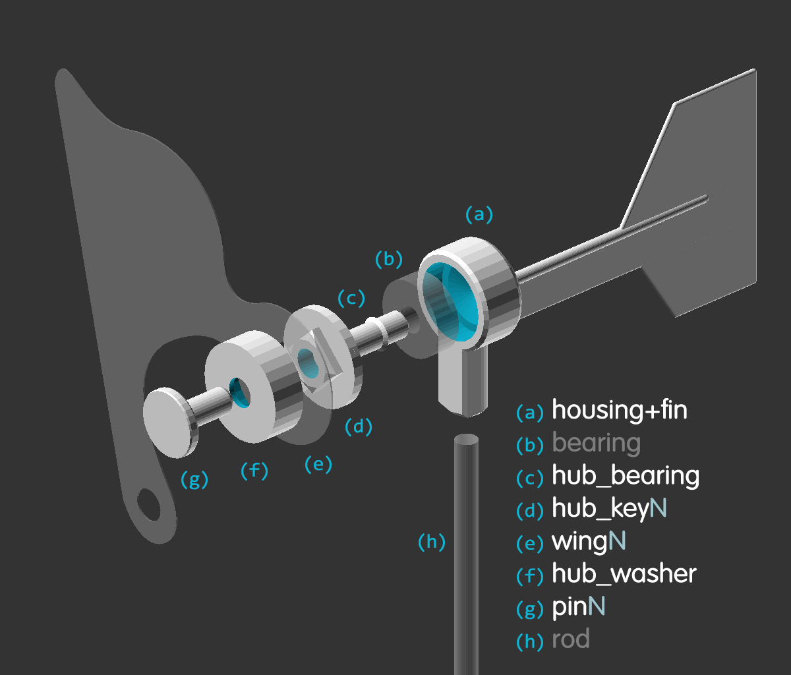

# pinwheel-system

STL and source model files for a variable wing pinwheel system

## printing
> note: the **hub_key** and **pin** parts must be matched to the number of **wings**.
> all other parts are compatible with any number of wings.

Parts for common configurations of 3&ndash;6 wings and holders with or without fins are pre-computed and available for download as STL models.

For 6-wing configurations, print 2 copies of wings 1&ndash;3.

All STL models have been sliced and printed successfully in PLA+ using the following settings:

- `layer height` 0.3mm
- `wall line count` 4
- `top & bottom layers` 3
- `infill density` 16%
- `infill pattern` triangles
- `printing temp` 205&deg;C
- `build plate temp` 55&deg;C
- `wall speed` 20&ndash;30 mm/s
- `travel speed` 85 mm/s
- `retraction distance` 3mm
- `retraction speed` 40 mm/s
- `fan speed` 100%
- `support overhang` 80&deg;
- `support top distance` 0.3mm
- `build plate adhesion` none

## assembly

### manifest
- `(a)` _housing+fin_ &mdash; optional fin helps maintain orientation in stronger winds
- `(b)` _bearing_ &mdash; 608 PP 8x22x7mm plastic bearing (glass balls, polypropylene races, nylon cage)
- `(c)` _hub_bearing_ &mdash; connects the bearing to the hub
- `(d)` _hub_keyN_ &mdash; locks wings into correct angular position
- `(e)` _hub_washer_ &mdash; creates space between wing bases and tips
- `(f)` _wingN_ &mdash; catches wind. 4&ndash;6 per pinwheel work best
- `(g)` _pinN_ &mdash; connects wings, washer, and hub
- `(h)` _rod_ &mdash; 6.5mm diameter stainless steel rod
- `(-)` _blowdryer_ &mdash; for bending wings and testing indoors
- `(-)` _superglue_ &mdash; cyanoacrylate works well for PLA
- `(-)` _clamp_ &mdash; for holding assembled parts while glue cures

### instructions

1. stack **wings** onto the **hub_key** with glue between each layer
1. use **pin** and **hub_washer** to temporarily hold wings in place
1. use _blowdryer_ to soften mid-section of **wings** and bend so tip and base holes align
1. thread **pin** through **wing** tips and **hub_washer** into **hub_key**
1. apply _glue_ to tip of **pin** and base of **hub_key**
1. attach **hub_bearing** to **hub_key**, taking care to align edges
1. _clamp_ from head of **pin** to tip of **hub_bearing** and let glue cure

_after glue is cured_

1. insert **hub_key** into **bearing** and carefully apply _glue_ around the protruding tip
1. set aside to let glue cure

_after glue is cured_

1. insert **bearing** into **housing**
1. place **housing** on **rod**
1. take the assembled pinwheel somewhere with wind
1. enjoy!

## modifying

The wing profile is defined in `wing.ai`, exported to [`wing.svg`](./wing.svg) for use in the OpenSCAD file.

All geometry is defined in [`pinwheel-system.scad`](./pinwheel-system.scad), to be rendered with [OpenSCAD](https://openscad.org/).
